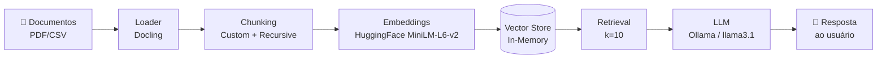

# Voa Bank RAG Assistant

## 📋 Descrição Geral

O **Voa Bank RAG Assistant** é um agente de inteligência artificial capaz de 
responder perguntas de colaboradores com base em documentos internos de uma 
fintech fictícia — o "Voa Bank". O projeto simula um cenário realista de 
suporte a compliance regulatório (LGPD e normas do BACEN), permitindo que 
colaboradores consultem, em linguagem natural, informações sobre políticas 
de privacidade, termos de uso, segurança, tarifas e dúvidas frequentes da 
empresa.

O sistema utiliza a arquitetura RAG (Retrieval-Augmented Generation) para 
garantir que as respostas do agente sejam sempre fundamentadas no conteúdo 
real dos documentos, reduzindo alucinações e permitindo rastreabilidade da 
fonte de cada resposta.

Todo o pipeline foi construído com um stack **local e offline**, garantindo 
que nenhum dado sensível trafegue para serviços de terceiros — um requisito 
importante em contextos regulatórios como o simulado neste projeto.

> ⚠️ Este é um projeto de portfólio/estudo de caso. O "Voa Bank" é uma 
> instituição fictícia e os documentos utilizados como base de conhecimento 
> foram gerados com apoio de IA (veja a seção [Sobre os dados utilizados](#-sobre-os-dados-utilizados)).


## Como rodar

```bash

# 1. Crie e ative o ambiente virtual
python -m venv venv
source venv/bin/activate        # Linux/macOS
venv\Scripts\activate           # Windows

# 2. Instale as dependências
pip install -r requirements.txt

```


## 🏗️ Arquitetura da Solução

O pipeline segue o fluxo clássico de RAG, com adaptações específicas para 
lidar com documentos que combinam texto narrativo e tabelas:




**Etapas do pipeline:**

1. **Carregamento (Loader):** os documentos PDF são processados pelo 
   [Docling](https://github.com/DS4SD/docling), que exporta o conteúdo para 
   Markdown preservando a estrutura de tabelas — essencial para não perder 
   informações como tarifas e planos (veja a comparação de loaders testados 
   [nesta seção](#-escolha-do-loader-de-pdf)).

2. **Chunking:** o texto narrativo é dividido usando 
   `RecursiveCharacterTextSplitter` (chunk_size=600, overlap=100). Linhas de 
   tabela são tratadas separadamente: cada linha é convertida em uma frase 
   narrativa independente (ex: `"Serviço: TED | Voa Bank Light: R$ 8,90 por 
   transferência"`), tornando essas informações plenamente recuperáveis.

3. **Embeddings:** geração de vetores semânticos usando o modelo local 
   `sentence-transformers/all-MiniLM-L6-v2` via HuggingFace — sem dependência 
   de APIs externas de embeddings.

4. **Armazenamento vetorial:** os embeddings são indexados em um 
   `InMemoryVectorStore` do LangChain *(nota: para produção, este armazenamento 
   deve ser substituído por um vector store persistente)*.

5. **Retrieval:** busca por similaridade com `k=10`, retornando os trechos 
   mais relevantes para a pergunta do usuário.

6. **Geração (LLM):** os trechos recuperados são enviados, junto com a 
   pergunta, para o modelo `llama3.1` rodando localmente via 
   [Ollama](https://ollama.com) (`temperature=0` para respostas determinísticas). 
   O prompt inclui instruções específicas para lidar corretamente com 
   negações e estruturas de regra geral/exceção — casos que tendem a gerar 
   falsos negativos ("não encontrado") em RAGs simples.

---

## 🛠️ Tecnologias e Ferramentas Utilizadas

| Categoria | Ferramenta | Observação |
|---|---|---|
| Orquestração RAG | [LangChain](https://www.langchain.com/) | Framework principal do pipeline |
| Carregamento de PDF | [Docling](https://github.com/DS4SD/docling) | Preserva estrutura de tabelas via export para Markdown |
| Chunking | `RecursiveCharacterTextSplitter` + função customizada | Tratamento especial para linhas de tabela |
| Embeddings | `sentence-transformers/all-MiniLM-L6-v2` (HuggingFace) | 100% local, sem custo de API |
| LLM | [Ollama](https://ollama.com) + `llama3.1` | Execução local, `temperature=0` |
| Vector Store | `InMemoryVectorStore` (LangChain) | A ser substituído por store persistente em produção |
| Ambiente de desenvolvimento | Python, Jupyter Notebook, VS Code | — |
| Deploy (planejado) | Oracle Cloud Infrastructure (OCI), Ampere A1.Flex (Always Free) | — |
| Controle de versão | Git + GitHub (SSH), Conventional Commits | — |
##  Sobre os dados utilizados

Este é um projeto de portfólio/estudo de caso. O "Voa Bank" é uma instituição 
financeira **fictícia**, criada para simular um ambiente realista de fintech 
regulada (LGPD, BACEN, regras de Pix/MED, COAF).

Os documentos em `/data/documentos_fonte` (Política de Privacidade, Termos de 
Uso, FAQ, Política de Segurança e Tarifas) foram **gerados com apoio de IA**, 
com o objetivo de reproduzir a estrutura, o tom e o nível de detalhe de 
documentos reais desse tipo de empresa — sem usar dados de nenhuma instituição 
real.

Esses documentos servem como base de conhecimento (corpus) para o agente RAG 
que está sendo desenvolvido neste repositório.


## 📄 Escolha do Loader de PDF

Durante o desenvolvimento, foram testadas diferentes bibliotecas para extração 
de conteúdo dos documentos PDF do Voa Bank, com foco especial em como cada 
uma lidava com **tabelas** (como as tabelas de tarifas e planos).

### PyMuPDF (testado e descartado)

A extração de texto funcionava bem para conteúdo narrativo, mas ao lidar com 
tabelas — especialmente tabelas com formatação mais complexa, como linhas 
zebradas — o conteúdo tabular era extraído de forma **fragmentada e sem 
preservar a estrutura de linhas e colunas**. Isso fazia com que informações 
importantes (como o valor de uma tarifa associado ao seu respectivo serviço) 
se perdessem ou ficassem desconectadas do contexto, prejudicando diretamente 
a qualidade da recuperação (retrieval) nessas seções dos documentos.

### Docling (escolha final)

A migração para o Docling resolveu esse problema: a biblioteca exporta o 
conteúdo para **Markdown preservando a estrutura das tabelas** (linhas e 
colunas mantidas de forma consistente). Isso permitiu implementar uma etapa 
adicional de processamento, onde cada linha de tabela é convertida em uma 
**frase narrativa independente** (ex: `"Serviço: TED | Voa Bank Light: 
R$ 8,90 por transferência"`), tornando essas informações plenamente 
recuperáveis pelo pipeline de RAG.

**Resultado:** essa mudança de loader, combinada com o processamento de 
tabelas em chunks narrativos, foi um dos fatores decisivos para elevar a 
taxa de acerto dos casos de teste estruturados, especialmente nas perguntas 
relacionadas a tarifas e planos.


### Comparativo de resultados nos casos de teste

| Loader   | Casos corretos | Observação principal |
|----------|-----------------|------------------------|
| PyMuPDF  | 21-22 de 32         | Perda de estrutura em tabelas, respostas incorretas sobre tarifas |
| Docling  | 29-30 de 32     | Estrutura tabular preservada via Markdown + chunking narrativo por linha |


# Casos de Teste — Pipeline RAG Voa Bank

Total de casos: 32

| ID | Dificuldade | Documento | Pergunta | Resposta Esperada |
|---|---|---|---|---|
| PRIV-01 | facil | 01_politica_privacidade_protecao_dados | Qual é a legislação principal que fundamenta a política de privacidade do Voa Bank? | A Lei Geral de Proteção de Dados (Lei nº 13.709/2018 - LGPD). |
| PRIV-02 | facil | 01_politica_privacidade_protecao_dados | Por quanto tempo o Voa Bank mantém o histórico de transações dos clientes? | 10 anos, conforme exigência do Banco Central (BACEN). |
| PRIV-03 | media | 01_politica_privacidade_protecao_dados | Se eu quiser solicitar a exclusão dos meus dados pessoais, qual o prazo de resposta e por qual canal devo pedir? | Pelo aplicativo, em 'Configurações > Privacidade e Dados', ou pelo e-mail dpo@voabank.com.br. O prazo de resposta é de até 15 dias úteis. |
| PRIV-04 | media | 01_politica_privacidade_protecao_dados | Com quais birôs de crédito o Voa Bank pode compartilhar meus dados para análise de crédito? | Serasa Experian e Boa Vista SCPC. |
| PRIV-05 | facil | 01_politica_privacidade_protecao_dados | Qual tipo de criptografia o Voa Bank usa para dados em trânsito? | TLS 1.3. |
| PRIV-06 | trap | 01_politica_privacidade_protecao_dados | O Voa Bank vende dados de clientes para empresas de marketing? | Não. O documento afirma explicitamente que o Voa Bank não vende dados pessoais a terceiros para fins de marketing. |
| TERMOS-01 | facil | 02_termos_condicoes_uso | Qual a idade mínima para abrir uma conta no Voa Bank sem autorização de responsável legal? | 18 anos. Entre 16 e 18 anos é permitido com autorização de responsável legal (conta Voa Jovem). |
| TERMOS-02 | media | 02_termos_condicoes_uso | O Voa Bank pode reduzir o limite do meu cartão de crédito sem aviso prévio? | Em geral não: reduções de limite exigem comunicação prévia de 15 dias. A exceção é em casos de suspeita de fraude ou inadimplência, quando a redução pode ser imediata. |
| TERMOS-03 | facil | 02_termos_condicoes_uso | O saldo em conta no Voa Bank é considerado depósito bancário? | Não. O saldo não constitui depósito bancário nos termos da regulação de bancos múltiplos, mas é segregado patrimonialmente conforme regulação do BACEN para instituições de pagamento. |
| TERMOS-04 | media | 02_termos_condicoes_uso | Em quais situações o Voa Bank pode encerrar minha conta sem dar aviso prévio de 30 dias? | Em casos de suspeita fundamentada de fraude, lavagem de dinheiro ou financiamento ao terrorismo; determinação legal ou regulatória; ou uso indevido comprovado da plataforma. |
| TERMOS-05 | facil | 02_termos_condicoes_uso | Qual o número da central telefônica de atendimento do Voa Bank? | 0800 555 0199 (ligação gratuita). |
| FAQ-01 | facil | 03_faq_transacoes_limites | Qual o limite diário de Pix durante a noite (período noturno)? | R$ 1.000,00, válido das 20h às 6h, para novos usuários. |
| FAQ-02 | media | 03_faq_transacoes_limites | Se eu aumentar meu limite de Pix para R$ 15.000,00, o aumento vale imediatamente? | Não. Aumentos acima de R$ 10.000,00 possuem carência de 24 horas para entrar em vigor, por medida de segurança do Pix (Resolução BCB nº 150/2021). |
| FAQ-03 | facil | 03_faq_transacoes_limites | É possível cancelar um Pix depois de enviado? | Não, o Pix é em tempo real e não pode ser cancelado. Em caso de fraude ou erro, o usuário pode acionar o Mecanismo Especial de Devolução (MED) em até 80 dias. |
| FAQ-04 | dificil | 03_faq_transacoes_limites | Fiz uma compra internacional de US$ 100 no cartão de crédito. Considerando a política de tarifas, quanto de IOF incide sobre essa transação? | IOF de 3,38% sobre o valor da transação internacional (informação cruzada entre o FAQ, que menciona o IOF de 3,38%, e o documento de Tarifas e Comissões, que confirma a mesma alíquota para compras internacionais no cartão de crédito). |
| FAQ-05 | media | 03_faq_transacoes_limites | Até que horas um boleto precisa ser pago para ser processado no mesmo dia? | Até às 20h30 (horário de Brasília). |
| FAQ-06 | trap | 03_faq_transacoes_limites | Existe algum limite para receber dinheiro via Pix? | Não há limite para recebimento de Pix. Os limites se aplicam apenas a valores enviados (Pix Enviado). |
| SEG-01 | facil | 04_politica_seguranca_prevencao_fraudes | O Voa Bank atende clientes por WhatsApp? | Não. O canal oficial de atendimento é exclusivamente o chat dentro do aplicativo ou o número 0800 555 0199, nunca WhatsApp. |
| SEG-02 | media | 04_politica_seguranca_prevencao_fraudes | Em quantos dias posso acionar o Mecanismo Especial de Devolução (MED) após uma fraude via Pix? | Até 80 dias após a transação. |
| SEG-03 | media | 04_politica_seguranca_prevencao_fraudes | O Voa Bank ressarce valores em qualquer caso de fraude? | Não em todos os casos. O ressarcimento integral se aplica a fraudes comprovadamente decorrentes de falha de segurança da plataforma, mas não cobre fraudes de engenharia social em que o próprio usuário forneceu voluntariamente suas credenciais. O prazo de ressarcimento é de até 10 dias úteis após a investigação. |
| SEG-04 | facil | 04_politica_seguranca_prevencao_fraudes | O que é o golpe de 'SIM Swap' mencionado na política de segurança? | É quando criminosos transferem a linha telefônica da vítima para um chip próprio, interceptando SMS de autenticação. Por isso o Voa Bank recomenda autenticação via aplicativo autenticador (TOTP) ou biometria em vez de depender apenas de SMS. |
| SEG-05 | dificil | 04_politica_seguranca_prevencao_fraudes | Quais tipos de autenticação de dois fatores são obrigatórios no Voa Bank, e como isso se relaciona com o limite de Pix mencionado no FAQ? | 2FA é obrigatório para alteração de senha, cadastro de nova chave Pix, aumento de limites e alteração de dados cadastrais. Isso se relaciona ao FAQ, que menciona que aumentos de limite de Pix acima de R$ 10.000,00 têm carência de 24h, reforçando a camada de segurança em operações sensíveis. |
| TAR-01 | facil | 05_tarifas_comissoes | Qual a mensalidade da conta Voa Bank Plus? | R$ 14,90 por mês (isenta com movimentação mínima de R$ 1.000/mês). |
| TAR-02 | media | 05_tarifas_comissoes | Quanto custa uma TED na conta Voa Bank Light? | R$ 8,90 por transferência. |
| TAR-03 | dificil | 05_tarifas_comissoes | Comparando os três planos, qual oferece TED gratuita ilimitada? | O plano Voa Bank Black oferece TED ilimitada gratuita. O Voa Bank Plus oferece TED gratuita apenas até 5 por mês (depois R$ 6,90), e o Voa Bank Light cobra R$ 8,90 por TED sempre. |
| TAR-04 | facil | 05_tarifas_comissoes | Qual a taxa de juros rotativo do cartão de crédito no plano Voa Bank Black? | Até 11,90% ao mês. |
| TAR-05 | media | 05_tarifas_comissoes | Quanto custa sacar dinheiro em rede conveniada (Banco24Horas) com o cartão de débito? | R$ 6,50 por saque, sendo o primeiro saque do mês gratuito. |
| TAR-06 | trap | 05_tarifas_comissoes | Qual a tarifa de manutenção da conta Voa Bank Light se eu não movimentar nenhum valor no mês? | A manutenção da conta Voa Bank Light é gratuita, sem exigência de movimentação mínima — diferente dos planos Plus e Black, que exigem movimentação mínima para isenção. |
| MULTI-01 | dificil | multiplos (02 + 04) | Se eu suspeitar que minha conta foi usada por terceiros para receber e repassar dinheiro rapidamente (conta laranja), o que pode acontecer com minha conta? | A conta pode ser bloqueada preventivamente (conforme a Política de Segurança, que cita esse padrão como sinal de alerta) e, segundo os Termos de Uso, pode ser encerrada unilateralmente sem aviso prévio de 30 dias, com possível comunicação às autoridades competentes. |
| MULTI-02 | dificil | multiplos (01 + 04) | O Voa Bank pode bloquear minha conta por determinação de autoridades? Quais autoridades são mencionadas nos documentos? | Sim. A Política de Privacidade cita BACEN, COAF e Receita Federal como autoridades reguladoras que recebem dados; a Política de Segurança acrescenta que bloqueios preventivos também podem ocorrer por determinação judicial ou de autoridade regulatória (BACEN, COAF, Poder Judiciário). |
| TRAP-GERAL-01 | trap | nenhum (fora do escopo) | Qual o valor do CDI usado pelo Voa Bank para render o saldo em conta? | A informação não está disponível nos documentos. Os Termos de Uso mencionam que o saldo rende automaticamente ao CDI, mas não especificam o percentual, informando apenas que está 'sujeito a alteração' conforme política vigente. Um bom pipeline de RAG deve indicar que não tem essa informação, em vez de inventar um percentual. |
| TRAP-GERAL-02 | trap | nenhum (fora do escopo) | O Voa Bank tem agências físicas para atendimento presencial? | Os documentos não mencionam agências físicas próprias do Voa Bank; o FAQ e as tarifas fazem referência apenas a 'agência parceira' para emissão de extrato impresso, sugerindo que o Voa Bank é uma instituição essencialmente digital, sem rede própria de agências. Um bom pipeline não deve afirmar categoricamente a existência ou ausência total de agências além do que está no texto. |