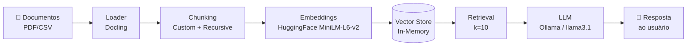

# Voa Bank RAG Assistant

## 📋 Descrição Geral

O **Voa Bank RAG Assistant** é um agente de inteligência artificial capaz de 
responder perguntas de colaboradores com base em documentos internos de uma 
fintech fictícia — o "Voa Bank". O projeto simula um cenário realista de 
suporte a compliance regulatório (LGPD e normas do BACEN), permitindo que 
colaboradores consultem, em linguagem natural, informações sobre políticas 
de privacidade, termos de uso, segurança, tarifas e dúvidas frequentes da 
empresa.

O sistema utiliza a arquitetura RAG (Retrieval-Augmented Generation) para 
garantir que as respostas do agente sejam sempre fundamentadas no conteúdo 
real dos documentos, reduzindo alucinações e permitindo rastreabilidade da 
fonte de cada resposta.

Todo o pipeline foi construído com um stack **local e offline**, garantindo 
que nenhum dado sensível trafegue para serviços de terceiros — um requisito 
importante em contextos regulatórios como o simulado neste projeto.

> ⚠️ Este é um projeto de portfólio/estudo de caso. O "Voa Bank" é uma 
> instituição fictícia e os documentos utilizados como base de conhecimento 
> foram gerados com apoio de IA (veja a seção [Sobre os dados utilizados](#-sobre-os-dados-utilizados)).


## Como rodar

```bash

# 1. Crie e ative o ambiente virtual
python -m venv venv
source venv/bin/activate        # Linux/macOS
venv\Scripts\activate           # Windows

# 2. Instale as dependências
pip install -r requirements.txt

```


## 🏗️ Arquitetura da Solução

O pipeline segue o fluxo clássico de RAG, com adaptações específicas para 
lidar com documentos que combinam texto narrativo e tabelas:




**Etapas do pipeline:**

1. **Carregamento (Loader):** os documentos PDF são processados pelo 
   [Docling](https://github.com/DS4SD/docling), que exporta o conteúdo para 
   Markdown preservando a estrutura de tabelas — essencial para não perder 
   informações como tarifas e planos (veja a comparação de loaders testados 
   [nesta seção](#-escolha-do-loader-de-pdf)).

2. **Chunking:** o texto narrativo é dividido usando 
   `RecursiveCharacterTextSplitter` (chunk_size=600, overlap=100). Linhas de 
   tabela são tratadas separadamente: cada linha é convertida em uma frase 
   narrativa independente (ex: `"Serviço: TED | Voa Bank Light: R$ 8,90 por 
   transferência"`), tornando essas informações plenamente recuperáveis.

3. **Embeddings:** geração de vetores semânticos usando o modelo local 
   `sentence-transformers/all-MiniLM-L6-v2` via HuggingFace — sem dependência 
   de APIs externas de embeddings.

4. **Armazenamento vetorial:** os embeddings são indexados em um 
   `InMemoryVectorStore` do LangChain *(nota: para produção, este armazenamento 
   deve ser substituído por um vector store persistente)*.

5. **Retrieval:** busca por similaridade com `k=10`, retornando os trechos 
   mais relevantes para a pergunta do usuário.

6. **Geração (LLM):** os trechos recuperados são enviados, junto com a 
   pergunta, para o modelo `llama3.1` rodando localmente via 
   [Ollama](https://ollama.com) (`temperature=0` para respostas determinísticas). 
   O prompt inclui instruções específicas para lidar corretamente com 
   negações e estruturas de regra geral/exceção — casos que tendem a gerar 
   falsos negativos ("não encontrado") em RAGs simples.

---

## 🛠️ Tecnologias e Ferramentas Utilizadas

| Categoria | Ferramenta | Observação |
|---|---|---|
| Orquestração RAG | [LangChain](https://www.langchain.com/) | Framework principal do pipeline |
| Carregamento de PDF | [Docling](https://github.com/DS4SD/docling) | Preserva estrutura de tabelas via export para Markdown |
| Chunking | `RecursiveCharacterTextSplitter` + função customizada | Tratamento especial para linhas de tabela |
| Embeddings | `sentence-transformers/all-MiniLM-L6-v2` (HuggingFace) | 100% local, sem custo de API |
| LLM | [Ollama](https://ollama.com) + `llama3.1` | Execução local, `temperature=0` |
| Vector Store | `InMemoryVectorStore` (LangChain) | A ser substituído por store persistente em produção |
| Ambiente de desenvolvimento | Python, Jupyter Notebook, VS Code | — |
| Deploy (planejado) | Oracle Cloud Infrastructure (OCI), Ampere A1.Flex (Always Free) | — |
| Controle de versão | Git + GitHub (SSH), Conventional Commits | — |
##  Sobre os dados utilizados

Este é um projeto de portfólio/estudo de caso. O "Voa Bank" é uma instituição 
financeira **fictícia**, criada para simular um ambiente realista de fintech 
regulada (LGPD, BACEN, regras de Pix/MED, COAF).

Os documentos em `/data/documentos_fonte` (Política de Privacidade, Termos de 
Uso, FAQ, Política de Segurança e Tarifas) foram **gerados com apoio de IA**, 
com o objetivo de reproduzir a estrutura, o tom e o nível de detalhe de 
documentos reais desse tipo de empresa — sem usar dados de nenhuma instituição 
real.

Esses documentos servem como base de conhecimento (corpus) para o agente RAG 
que está sendo desenvolvido neste repositório.


## 📄 Escolha do Loader de PDF

Durante o desenvolvimento, foram testadas diferentes bibliotecas para extração 
de conteúdo dos documentos PDF do Voa Bank, com foco especial em como cada 
uma lidava com **tabelas** (como as tabelas de tarifas e planos).

### PyMuPDF (testado e descartado)

A extração de texto funcionava bem para conteúdo narrativo, mas ao lidar com 
tabelas — especialmente tabelas com formatação mais complexa, como linhas 
zebradas — o conteúdo tabular era extraído de forma **fragmentada e sem 
preservar a estrutura de linhas e colunas**. Isso fazia com que informações 
importantes (como o valor de uma tarifa associado ao seu respectivo serviço) 
se perdessem ou ficassem desconectadas do contexto, prejudicando diretamente 
a qualidade da recuperação (retrieval) nessas seções dos documentos.

### Docling (escolha final)

A migração para o Docling resolveu esse problema: a biblioteca exporta o 
conteúdo para **Markdown preservando a estrutura das tabelas** (linhas e 
colunas mantidas de forma consistente). Isso permitiu implementar uma etapa 
adicional de processamento, onde cada linha de tabela é convertida em uma 
**frase narrativa independente** (ex: `"Serviço: TED | Voa Bank Light: 
R$ 8,90 por transferência"`), tornando essas informações plenamente 
recuperáveis pelo pipeline de RAG.

**Resultado:** essa mudança de loader, combinada com o processamento de 
tabelas em chunks narrativos, foi um dos fatores decisivos para elevar a 
taxa de acerto dos casos de teste estruturados, especialmente nas perguntas 
relacionadas a tarifas e planos.


### Comparativo de resultados nos casos de teste

| Loader   | Casos corretos | Observação principal |
|----------|-----------------|------------------------|
| PyMuPDF  | 21-22 de 32         | Perda de estrutura em tabelas, respostas incorretas sobre tarifas |
| Docling  | 29-30 de 32     | Estrutura tabular preservada via Markdown + chunking narrativo por linha |